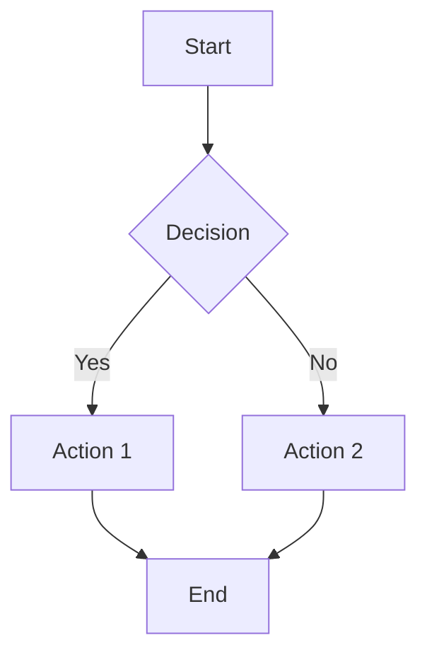
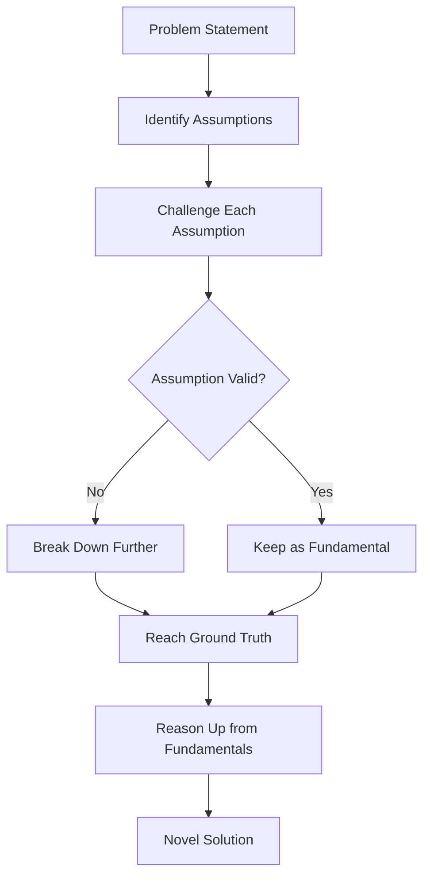
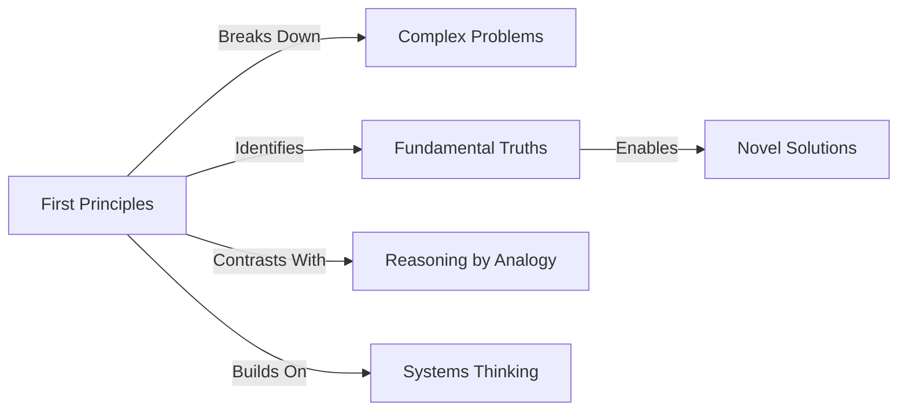
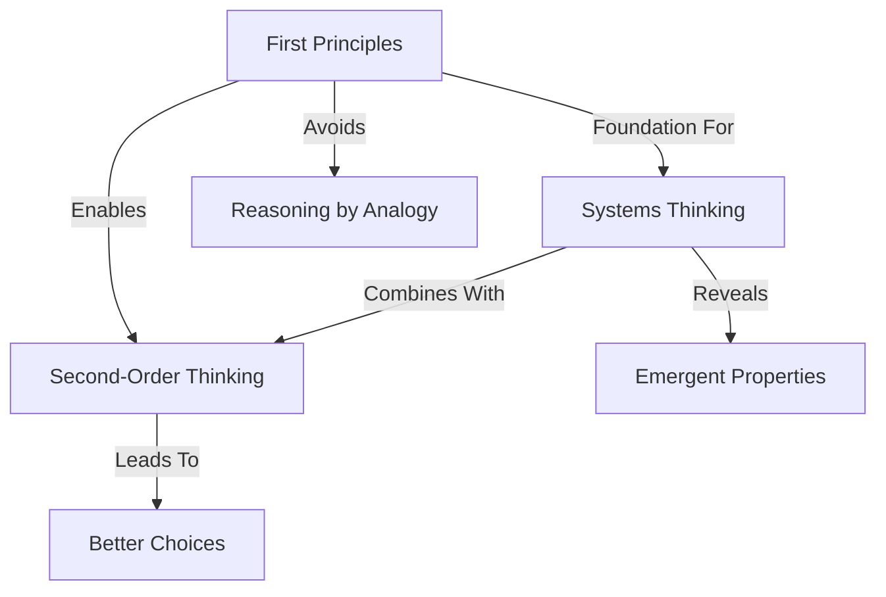
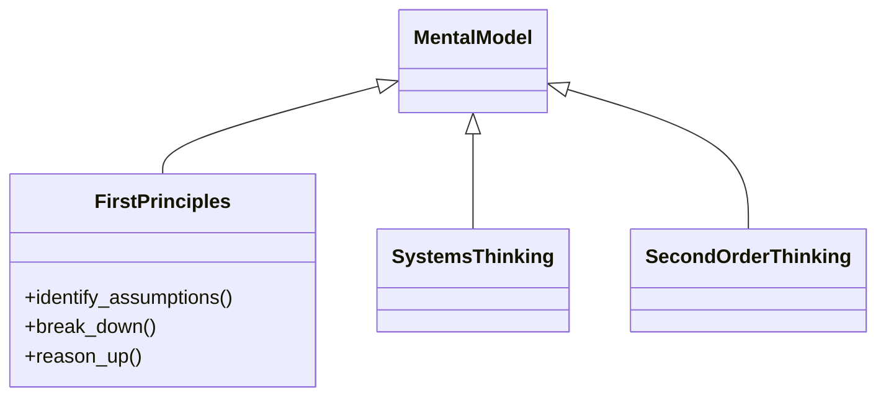
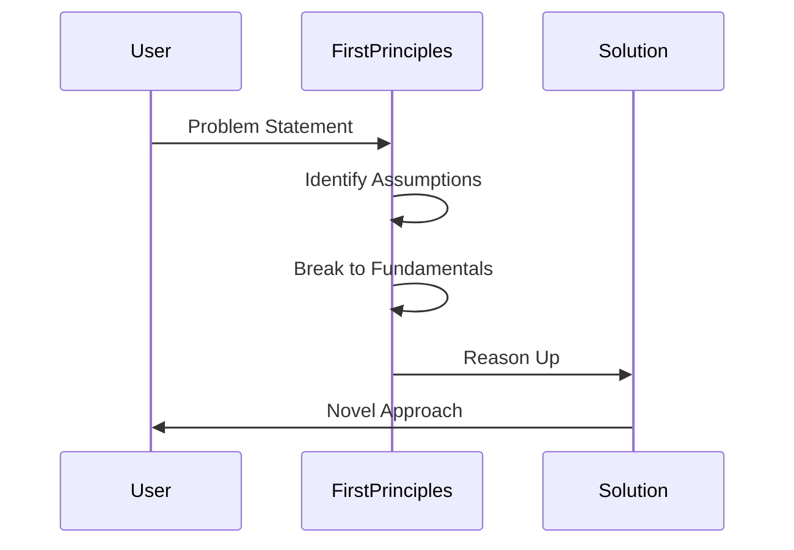
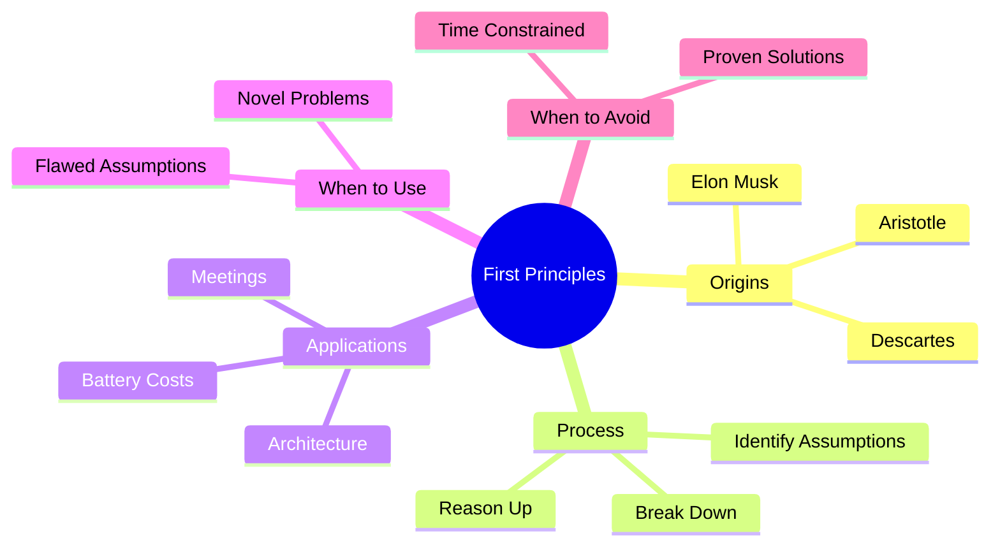
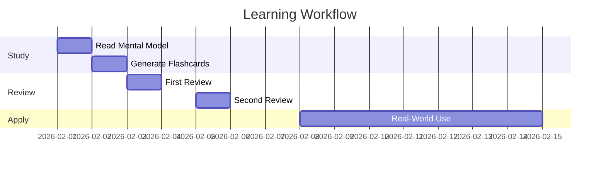

# Diagram Types Reference

Complete guide to all supported Mermaid diagram types with syntax examples.

---

## Type 1: Flowchart (Process Flow)

**Use For**: Processes, workflows, decision trees, algorithms

**Mermaid Syntax**:

**Example**: First Principles Thinking process

**Best For**:
- Sequential processes
- Decision logic
- Algorithm flows
- Step-by-step procedures

---

## Type 2: Concept Map (Relationships)

**Use For**: Mental model relationships, idea connections, concept hierarchies

**Mermaid Syntax**:

**Example**: Mental Model Ecosystem

**Best For**:
- Relationships between concepts
- Knowledge networks
- Cause-and-effect chains
- Conceptual dependencies

---

## Type 3: Class Diagrams (Structure)

**Use For**: Taxonomies, classifications, component breakdowns

**Mermaid Syntax**:

**Best For**:
- Inheritance relationships
- Component structures
- Classification systems
- Object hierarchies

---

## Type 4: Sequence Diagrams (Temporal Flow)

**Use For**: Workflows over time, interactions, step-by-step processes

**Mermaid Syntax**:

**Best For**:
- Actor interactions
- Message flows
- API call sequences
- Time-ordered events

---

## Type 5: Mindmaps (Radial Structure)

**Use For**: Brainstorming, topic exploration, hierarchical breakdowns

**Mermaid Syntax**:

**Best For**:
- Central concept with branches
- Hierarchical organization
- Brainstorming sessions
- Topic exploration

---

## Type 6: Gantt Charts (Timeline)

**Use For**: Schedules, project plans, temporal dependencies

**Mermaid Syntax**:

**Best For**:
- Project timelines
- Task dependencies
- Schedule planning
- Milestone tracking

---

## Quick Selection Guide

| Content Type | Recommended Diagram |
|--------------|---------------------|
| Process with steps | Flowchart |
| Idea relationships | Concept Map |
| Classification | Class Diagram |
| Actor interactions | Sequence Diagram |
| Hierarchical breakdown | Mindmap |
| Timeline/schedule | Gantt Chart |
| Decision logic | Flowchart |
| Network of concepts | Concept Map |

---

**Back to**: [[SKILL|Main Skill Documentation]]
