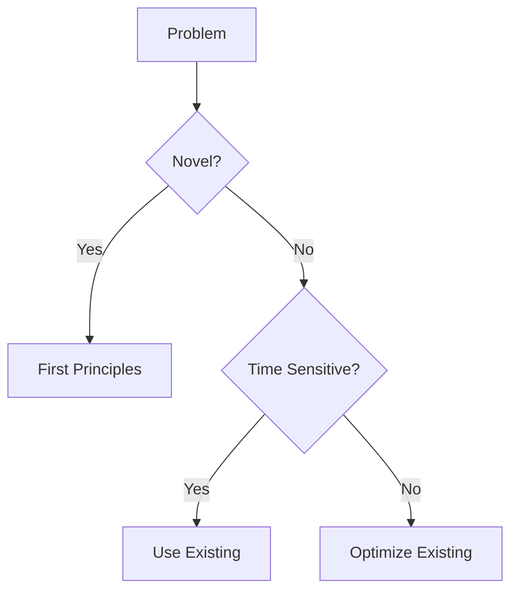
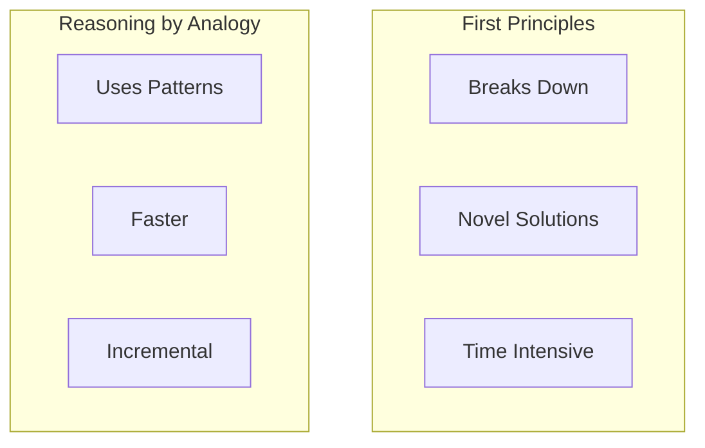
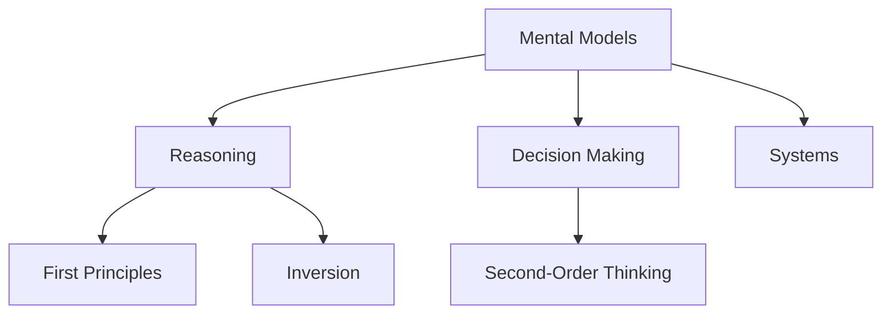

# Usage Examples & Patterns

Real-world examples and common diagram patterns.

---

## Usage Examples

### Example 1: Visualize Mental Model Process
```bash
/diagram "mental-models/First Principles Thinking.md" --type=flowchart
```

**Result**: Flowchart showing the 3-step process of identifying assumptions, breaking down, and reasoning up.

---

### Example 2: Show Mental Model Relationships
```bash
/diagram --relationships "First Principles, Systems Thinking, Second-Order Thinking"
```

**Result**: Concept map showing how these three mental models connect and build on each other.

---

### Example 3: Visualize Research Synthesis Structure
```bash
/diagram "projects/how-i-ai/How I AI - Principles Document.md" --type=mindmap
```

**Result**: Mind map showing the hierarchy of principles, patterns, and meta-patterns.

---

### Example 4: Workflow Visualization
```bash
/diagram "context/workflows/processes/research-synthesis-pipeline.md" --type=flowchart
```

**Result**: Flowchart showing the 6-phase research synthesis workflow.

---

## Common Diagram Patterns

### Pattern 1: Decision Tree


**Use For**: Decision logic, conditional workflows

---

### Pattern 2: Comparison Matrix


**Use For**: Side-by-side comparisons, contrasting approaches

---

### Pattern 3: Cycle/Loop


**Use For**: Iterative processes, feedback loops, continuous improvement

---

### Pattern 4: Hierarchy


**Use For**: Classification, taxonomies, organizational structures

---

## Integration with Other Skills

### With `/mental-model`
When creating a mental model, automatically suggest diagram:
```bash
/mental-model "First Principles Thinking"
# Creates mental model note

/diagram "mental-models/First Principles Thinking.md"
# Adds visual representation
```

### With `/research-synthesis`
Visualize pattern hierarchies:
```bash
/research-synthesis [sources]
# Creates principles document

/diagram [principles-doc] --type=mindmap
# Visualizes principle structure
```

### With `/learn`
Visual aids for studying:
```bash
/learn start "Systems Thinking"
# Begin studying

/diagram "mental-models/Systems Thinking.md"
# Create visual aid for comprehension
```

---

## When to Create Diagrams

**DO Create Diagrams For**:
- Processes with 3+ steps
- Concepts with 4+ relationships
- Hierarchies or taxonomies
- Complex workflows
- Comparative analyses

**DON'T Create Diagrams For**:
- Simple definitions
- Linear lists
- Single concepts without relationships
- Text that's already clear

---

## Diagram Maintenance

**Update diagrams when**:
- Source content changes significantly
- Relationships are clarified
- New connections are discovered
- Feedback indicates confusion

**Archive diagrams when**:
- Source content is removed
- Diagram is superseded by better version
- Concept is no longer relevant

---

**Back to**: [[SKILL|Main Skill Documentation]]
