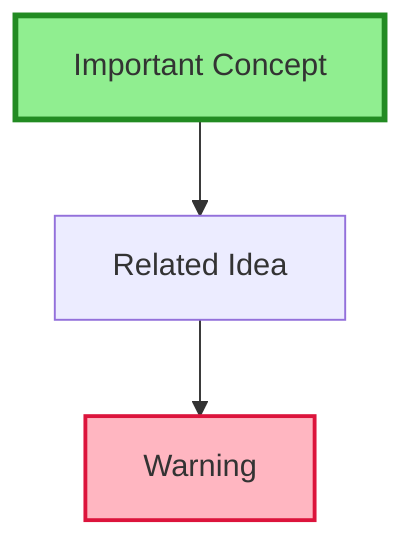
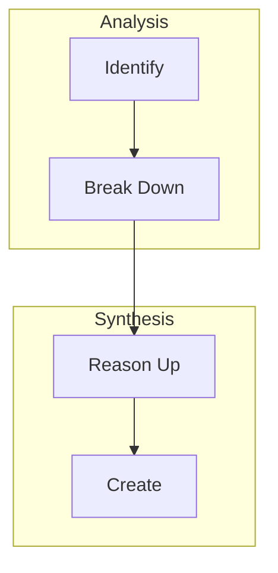

# Advanced Syntax & Troubleshooting

Complete reference for advanced features, customization, and problem-solving.

---

## Diagram Quality Guidelines

### Good Diagrams

✅ **Clear and Simple**:
- 7-12 nodes maximum
- Clear labels
- Logical flow

✅ **Well-Labeled**:
- Edge labels explain relationships
- Node names are descriptive
- Legend provided if needed

✅ **Appropriate Type**:
- Flowchart for processes
- Concept map for relationships
- Mind map for hierarchies

### Poor Diagrams

❌ **Too Complex**:
- 30+ nodes
- Crossing lines everywhere
- Unclear flow

❌ **Unlabeled**:
- Arrows with no labels
- Generic node names (A, B, C with no context)

❌ **Wrong Type**:
- Mind map for sequential process
- Flowchart for network relationships

---

## Advanced Features

### Styling & Themes

Add colors and styles to emphasize concepts:



**Use Cases**:
- Green for positive/recommended
- Red for warnings/avoid
- Blue for informational
- Bold borders for emphasis

### Subgraphs for Grouping



**Benefits**:
- Visual organization
- Logical grouping
- Clearer structure

### Links in Diagrams (Obsidian-Specific)


**Note**: Clickable links work in Obsidian preview mode

---

## Best Practices

### Node Design
- Keep labels under 20 characters
- Use line breaks (`<br/>`) for multi-line labels
- Use descriptive names over generic IDs
- Group related nodes visually

### Edge Design
- Always label relationships in concept maps
- Use arrows consistently (direction matters)
- Keep edge labels concise (1-3 words)

### Layout Optimization
- Choose appropriate direction (TD, LR, BT)
- Use subgraphs to reduce visual clutter
- Limit crossing lines
- Maintain visual balance

---

## Customization Options

### Diagram Complexity
```bash
/diagram [source] --complexity=simple   # 5-7 nodes max
/diagram [source] --complexity=detailed # Full coverage
```

### Output Location
```bash
/diagram [source] --embed         # Add to source note
/diagram [source] --separate      # Create diagram file
/diagram [source] --both          # Both options
```

### Diagram Orientation
```bash
/diagram [source] --direction=TD  # Top to Down
/diagram [source] --direction=LR  # Left to Right
/diagram [source] --direction=BT  # Bottom to Top
```

---

## Troubleshooting

### Diagram Won't Render
**Issue**: Syntax error in Mermaid code
**Solution**:
- Check for unclosed quotes
- Verify node names don't have special characters
- Ensure proper indentation
- Test in [Mermaid Live Editor](https://mermaid.live/)

### Diagram Too Complex
**Issue**: Too many nodes, unclear structure
**Solution**:
- Break into multiple smaller diagrams
- Use subgraphs for grouping
- Simplify to show only essential relationships

### Obsidian Doesn't Render
**Issue**: Obsidian not showing diagram
**Solution**:
- Ensure code block starts with ```mermaid
- Check Obsidian settings for Mermaid support
- Try preview mode (not edit mode)

### Crossing Lines
**Issue**: Many overlapping edges
**Solution**:
- Change diagram direction
- Reorder nodes
- Split into multiple diagrams
- Use subgraphs

### Poor Layout
**Issue**: Nodes poorly positioned
**Solution**:
- Adjust direction (TD vs LR)
- Reorder node declarations
- Use invisible edges for spacing

---

## Limitations

### What Works Well
- Process flows (5-15 steps)
- Concept relationships (up to 20 connections)
- Hierarchies (2-4 levels deep)
- Simple timelines

### What's Challenging
- Very large networks (30+ nodes)
- Highly interconnected graphs (many crossing lines)
- 3D or spatial relationships
- Real-time or animated diagrams

### Mermaid Limitations
- Limited styling options compared to dedicated tools
- Can't embed in some export formats
- Performance with very large diagrams
- No hand-drawn or sketch style

---

## Color Palette

### Recommended Colors

**Status/State**:
- Success: `#90EE90` (light green)
- Warning: `#FFD700` (gold)
- Error: `#FFB6C1` (light red)
- Info: `#ADD8E6` (light blue)

**Categories**:
- Primary: `#e1f5e1` (pale green)
- Secondary: `#e1e5f5` (pale blue)
- Tertiary: `#f5e1e1` (pale red)

**Emphasis**:
- High: Bold stroke (`stroke-width:3px`)
- Medium: Normal stroke (`stroke-width:2px`)
- Low: Thin stroke (`stroke-width:1px`)

---

## Syntax Quick Reference

### Flowchart Node Shapes
```
A[Rectangle]
B(Rounded)
C([Stadium])
DSubroutine
E[(Database)]
F((Circle))
G>Asymmetric]
H{Diamond}
I{{Hexagon}}
J[/Parallelogram/]
K[\Parallelogram alt\]
L[/Trapezoid\]
M[\Trapezoid alt/]
```

### Arrow Types
```
-->   Solid arrow
-.-   Dotted line
==>   Thick arrow
-.->  Dotted arrow
--o   Circle end
--x   Cross end
```

### Graph Directions
```
TD or TB  Top to Down/Bottom
BT        Bottom to Top
LR        Left to Right
RL        Right to Left
```

---

**Back to**: [[SKILL|Main Skill Documentation]]
