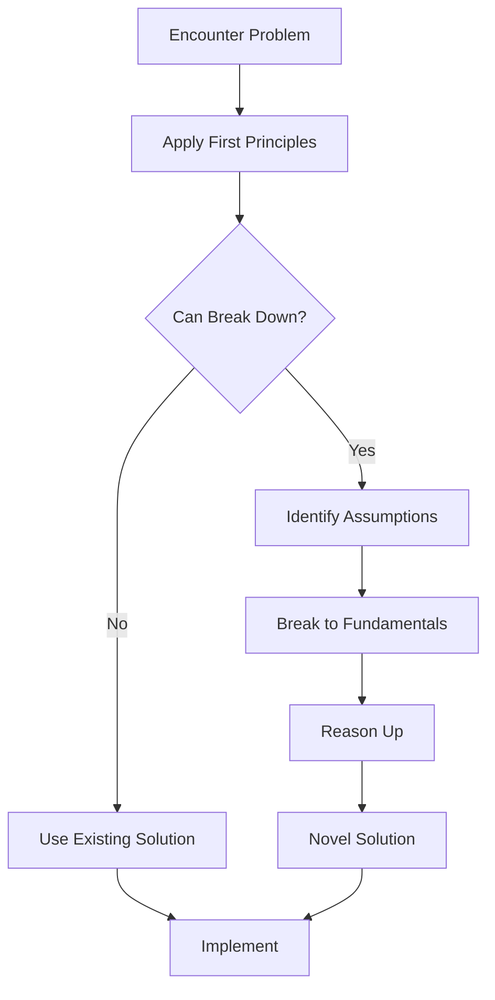
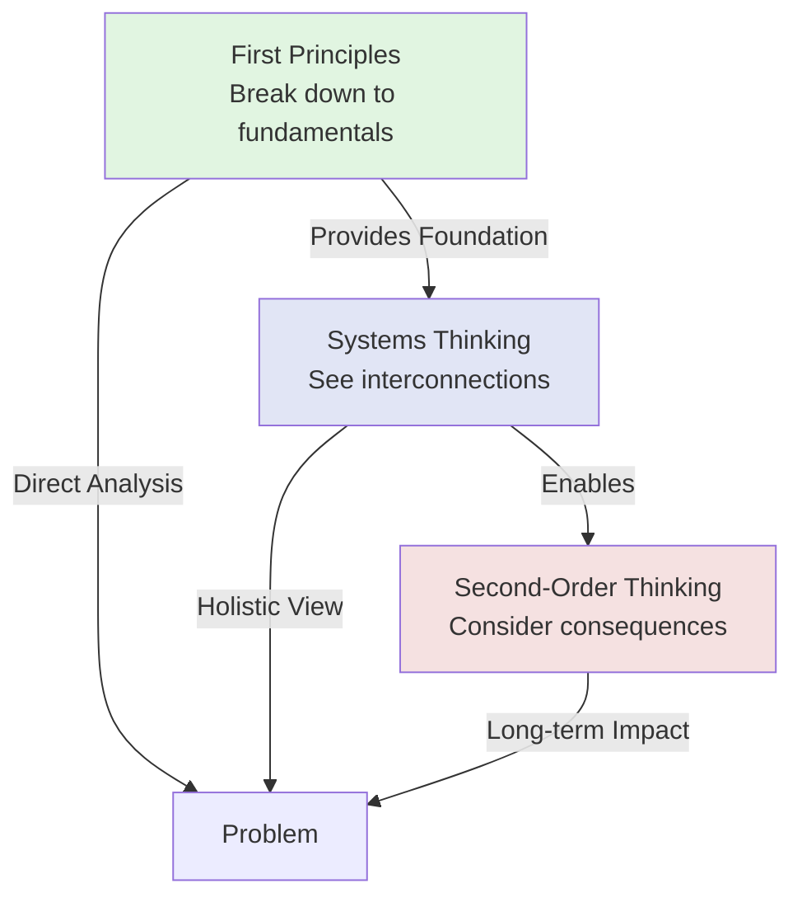

# Diagram Creation Workflow

Complete step-by-step guide for creating effective diagrams.

---

## Phase 1: Content Analysis

### Step 1: Identify Source Material

Ask user what to visualize:
- **Mental model**: Visualize concept relationships or process
- **Process/workflow**: Create flowchart
- **Relationships**: Show connections between concepts
- **Hierarchy**: Display classification or structure
- **Timeline**: Gantt chart for schedules
- **Custom**: User describes what they want visualized

### Step 2: Read Source Content

```bash
Read: [source-file-path]
```

Extract key elements:
- **Concepts/Nodes**: Main ideas, steps, or components
- **Relationships/Edges**: How concepts connect
- **Flow**: Sequential or hierarchical structure
- **Decision Points**: Where choices are made
- **Groupings**: Categories or clusters

---

## Phase 2: Diagram Design

### Step 3: Choose Diagram Type

Based on content structure, recommend diagram type:

**Flowchart** when:
- Content describes a process or workflow
- There are decision points
- Steps occur in sequence
- Example: "3 steps of First Principles"

**Concept Map** when:
- Multiple concepts relate to each other
- Relationships are the focus
- Network structure exists
- Example: "How mental models connect"

**Mind Map** when:
- Central concept with multiple branches
- Hierarchical breakdown needed
- Brainstorming structure
- Example: "First Principles components"

**Class Diagram** when:
- Taxonomy or classification
- Inheritance relationships
- Component structure
- Example: "Mental model categories"

**Sequence Diagram** when:
- Temporal interactions
- Step-by-step with actors
- Communication flow
- Example: "Learning workflow over time"

Use AskUserQuestion if multiple types could work:
- "Would you prefer a flowchart (process) or concept map (relationships)?"

### Step 4: Design Diagram Structure

**For Flowcharts**:
- Identify start/end points
- Map decision branches
- Show process flow with arrows

**For Concept Maps**:
- Place central concept
- Add related concepts
- Draw relationships with labeled edges

**For Mind Maps**:
- Central node = main concept
- Branches = subcategories
- Leaves = specific examples

---

## Phase 3: Mermaid Generation

### Step 5: Generate Mermaid Syntax

Create clean, properly formatted Mermaid code:

**Best Practices**:
- Use clear, concise node labels
- Limit diagram to 7-12 nodes (unless complexity required)
- Use consistent node naming (A, B, C or descriptive names)
- Add edge labels for relationships
- Group related nodes visually

**Example - Mental Model Process**:


**Example - Concept Relationships**:


---

## Phase 4: Integration

### Step 6: Embed in Source Note

**Option 1: Append to Existing Note**
Add diagram section to mental model or note:

```markdown
## Visual Representation

```mermaid
[diagram code]
```

**Description**: [Brief explanation of what the diagram shows]
```

**Option 2: Create Separate Diagram File**
For complex diagrams or reusable visualizations:

**File**: `/diagrams/[concept-name]-diagram.md`

```markdown
# [Concept Name] - Visual Diagram

**Source**: First Principles Thinking
**Type**: Flowchart
**Created**: 2026-02-01

## Diagram

```mermaid
[diagram code]
```

## Explanation

[What the diagram shows and how to read it]

## Related Diagrams
- systems thinking diagram
- mental model ecosystem
```

### Step 7: Link Bidirectionally

**In source note**:
```markdown
**Diagram**: first principles diagram
```

**In diagram note**:
```markdown
**Source**: First Principles Thinking
```

---

## Quality Checklist

Before finalizing:
- [ ] Diagram type matches content structure
- [ ] Node labels are clear and concise
- [ ] Relationships are labeled
- [ ] Flow direction is logical
- [ ] Complexity is appropriate (7-12 nodes ideal)
- [ ] Syntax is valid (test in Mermaid Live Editor if unsure)
- [ ] Explanation provided
- [ ] Links are bidirectional

---

**Back to**: [[SKILL|Main Skill Documentation]]
